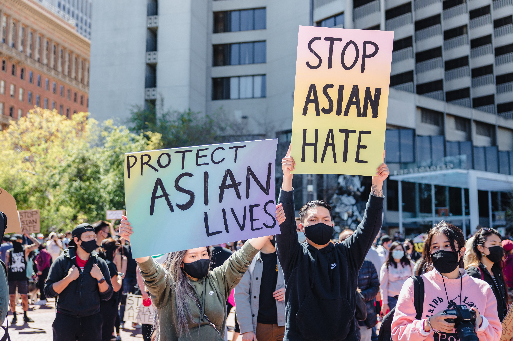

theme: Plain Jane, 2
footer: Kenji Rikitake / oueees 20230620 topic00
slidenumbers: true
autoscale: true

# oueees-202306 topic 00:
# [fit] 電気工学特別講義
# [fit] 2023年6月20日分
# [fit] イントロダクション

<!-- Use Deckset 2.0, 16:9 aspect ratio -->

---

# [fit] OU EE ES Lecture Series
# [fit] June 20, 2023
# [fit] Lecture introduction

---

# Kenji Rikitake

## りきたけ けんじ

## 力武 健次

20-JUN-2023
School of Engineering Science, Osaka University
On the internet
@jj1bdx

Copyright ©2018-2023 Kenji Rikitake.
This work is licensed under a [Creative Commons Attribution 4.0 International License](https://creativecommons.org/licenses/by/4.0/).

---

# CAUTION

Osaka University School of Engineering Science prohibits copying/redistribution of the lecture series video/audio files used in this lecture series.

大阪大学基礎工学部からの要請により、本講義で使用するビデオ/音声ファイルの複製や再配布は禁止されています。

---

# Lecture notes and reporting

* <https://github.com/jj1bdx/oueees-202306-public/>
* Check out the README.md file and the issues!
* Keyword at the end of the talk
* URL for submitting the report at the end of the talk

---

## It's already June 2023, but
# [fit] *COVID-19 is still there*
## [fit] I've suffered from COVID-19 on July 2022
## [fit] It's horrible, painful, and persistent for months

---

# [fit] To prevent COVID-19 outbreak again:
## [fit] Practice basic hygiene procedures
## Wash your hands
## Minimize the virus exposure
## Get vaccinated
## Wear masks whenever required

---

# [fit] Since 24-FEB-2022:
# [fit] WAR on Ukraine
# [fit] by Russian full invasion against the democracy
# [fit] and *Japan has already engaged in the war*

---

# As of June 2023, Japan has most deeply committed in the military and peace-keeping activities on regional conflicts since 1952

---

# The levels of tension in the regional conflicts which Japan is engaged in are rising to much higher levels than those in the cold war during 1945-1991

---

# We need to revise our understating of how the world is built and formed

---

# [Fit] The Digital Divide has become irrelevant
# [fit] The Physical Divide

---

# The Physical Divide [^1]

>Digital is now cheap, it's physical that is expensive.
70 years ago the cost of putting a bunch of transistors on a chip was astronomical. Now that’s cheap. What’s expensive is putting a bunch of people in a room.
-- Balaji S. Srinivasan

[^1]: <https://twitter.com/balajis/status/1247518697385684992?lang=en>

---

# [Fit] Recognition of the Western nations including Japan:
# [fit] Digital-first society has come
# [fit] Internet is infrastructure
# [fit] Software builds the world

---

# In reality:
# [fit] Physical ubiquity matters
# [fit] i.e., we need ample supplies of daily necessities
# [fit] to keep the software world running smoothly!

---

# [fit] Infrastructure crises

## [fit]
## [fit] Broken supply chains: food, semiconductors
## [fit] Limited natural resources: crude oil, natural gas
## [fit] Global warming and water/electricity shortages
## [fit]
## [fit] *Are we heading into the apocalypse?*

---

# Cruelty and inequality going on everywhere by people with power to enslave oppressed and marginalized people

---

---

# [fit] 2020
# [fit] Black Lives Matter

---

---

# [fit] 2021
# [fit] Stop Asian Hate

---

# In 2020, Kyiv, Ukraine

---

# Borodyanka, Kyiv Oblast, Ukraine
# after 24-FEB-2022 Russian invasion

---

# [fit] 2022
# [fit] War on Ukraine

---

# [fit] We need to survive
# [fit] in the global warzone

---

# [fit] Safety first
# [fit] Stay alive
# [fit] Get out of slavery
# [fit] Prevent slavery

---

# [fit] Who I am
# [fit] 自己紹介

---

# [fit] Professional
# [fit] Internet
# [fit] Engineer

---

# [fit] 技術士（情報工学部門）
# [fit] 力武健次技術士事務所 所長
# 情報処理安全確保支援士

---

# [fit] Guest Researcher
# [fit] Pepabo R&D Institute
# [fit] GMO Pepabo, Inc.
# [fit] GMOペパボ株式会社
# [fit] ペパボ研究所 客員研究員

---

# My career

Erlang, Elixir, C, FreeBSD, Linux, TCP/IP, PHP, mruby, Lua, C++, C#, Visual Studio, Moodle, macOS, Windows, Vim, VS Code, Arduino, AVR, radio engineering, music, distributed systems, fault tolerance, software defined radio, Python, R, machine learning and deep learning apprentice, whatever.

33 years in Computer Science, 18 years since PhD, 47 years of ham radio op as @jj1bdx, 2010-2012: Professor, ACCMS/IIMC, Kyoto University, ACM Senior Member, whatever.

---

# My recent career:

## [fit] I've got laid off on June 2013
## [fit] 10 years of ongoing survival
## [fit] as an independent IT consultant
## [fit] and a *software engineer*

---

# [fit] Past records are meaningless
# [fit] You need to live your life and earn money
# [fit] ... then you can work on what you really want to do

---

# [fit] Ignore past achievements
# [fit] Focus on *now*

---

# [fit] Ignore everybody
# [fit] to stay creative and maintain originality

---

# Lecture theme:
# [fit] Information delivery on internet

---

# In other words:
# [fit] How internet works

---

# [fit] 容錯設計
# [fit] Fault-tolerant design

---

# [fit] Internet is a survival technology

---

# [fit] Modern life is full of failures
# [fit] How internet works under failures?

---

# Technology 1:
# [fit] Packet switching

---

# Technology 2:
# [fit] Flexible packet routing

---

# Technology 3:
# [fit] Centralization, and:
# [fit] decentralization

---

# Topic sections (1/3)

* Latency and Laws of Physics
* Centralized communication
* Multiplexing
* Packet switching
* Routing basics

---

# Topic sections (2/3)

* IP addresses
* Routing in details
* Network transports
* Cloud computing basics
* Social implication of cloud computing

---

# Topic sections (3/3)

* Network fault-tolerance
* Network services and programming trends
* Wireless/radio and internet
* Information warfare and radio surveillance
* "Artificial Intelligence" and the reality
* Reference books
* Career choice

---

# Summary:

# [fit] Divide data into packets
# [fit] Route flexibly and wisely
# [fit] Decentralize and distribute

---

# [fit] OK let's get down to business!

---

# Picture credits:

* My photo: by Suzuki Shin, at 鈴木心写真館, courtesy [Wantedly Official Profile](https://www.wantedly.com/id/jj1bdx)
* Bushfires below Stacks Bluff, Tasmania, Australia: Matt Palmer, from Unsplash, <https://unsplash.com/photos/kbTp7dBzHyY>  
* Black Lives Matter: Nicole Baster, from Unsplash, <https://unsplash.com/photos/6_y5Sww0-h4>
* Stop Asian Hate: Jason Leung, from Unsplash, <https://unsplash.com/photos/WAch7jpfk8U>
* Kyiv (on October 2020): Viktor Talashuk, from Unsplash, <https://unsplash.com/photos/iMhFpP0laGw>
* Borodyanka, Kyiv Oblast, Ukraine: Mikhail Volkov, from Unsplash, <https://unsplash.com/photos/2KRGjLL4xYo> 

<!--
Local Variables:
mode: markdown
coding: utf-8
End:
-->

