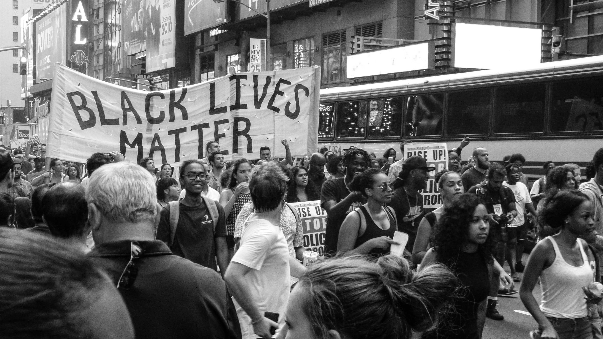

theme: Plain Jane, 2
footer: Kenji Rikitake / oueees 20230620 topic00
slidenumbers: true
autoscale: true

# oueees-202306 topic 00:
# [fit] 電気工学特別講義
# [fit] 2023年6月20日分
# [fit] イントロダクション

<!-- Use Deckset 2.0, 16:9 aspect ratio -->

---

# [fit] OU EE ES Lecture Series
# [fit] June 20, 2023
# [fit] Lecture introduction

---

# Kenji Rikitake

## りきたけ けんじ

## 力武 健次

20-JUN-2023
School of Engineering Science, Osaka University
On the internet
@jj1bdx

Copyright ©2018-2023 Kenji Rikitake.
This work is licensed under a [Creative Commons Attribution 4.0 International License](https://creativecommons.org/licenses/by/4.0/).

---

# CAUTION

Osaka University School of Engineering Science prohibits copying/redistribution of the lecture series video/audio files used in this lecture series.

大阪大学基礎工学部からの要請により、本講義で使用するビデオ/音声ファイルの複製や再配布は禁止されています。

---

# Lecture notes and reporting

* <https://github.com/jj1bdx/oueees-202306-public/>
* Check out the README.md file and the issues!
* Keyword at the end of the talk
* URL for submitting the report at the end of the talk

---

# [fit] COVID-19
# [fit] has changed
# [fit] everything
# [fit] ... and is still there!

---

# [fit] Since 24-FEB-2022:
# [fit] WAR on Ukraine
# [fit] by Russian full invasion against the democracy

---

# [fit] Since 24-FEB-2022:
# [fit] WAR on Ukraine
# [fit] by Russian full invasion against the democracy
# [fit] and **Japan has already engaged in**

---

# [Fit] The Digital Divide has become irrelevant
# [fit] The Physical Divide

---

# The Physical Divide [^1]

>Digital is now cheap, it's physical that is expensive.
70 years ago the cost of putting a bunch of transistors on a chip was astronomical. Now that’s cheap. What’s expensive is putting a bunch of people in a room.
-- Balaji S. Srinivasan

[^1]: <https://twitter.com/balajis/status/1247518697385684992?lang=en>

---

# [fit] Digital-first society has come
# [fit] Internet is infrastructure
# [fit] Software builds the world

---

# [fit] Physical ubiquity matters:
# [fit] Broken supply chains
# [fit] Weak infrastructures kill people
# [fit] Natural resources are *limited*

---

# [fit] In the meanwhile:
# [fit] Oppressions everywhere
# [fit] by people with power
# [fit] to enslave oppressed people

---

---

# [fit] 2020
# [fit] Black Lives Matter

---

---

# [fit] 2021
# [fit] Stop Asian Hate

---

# In 2020, Kyiv, Ukraine

---

# Borodyanka, Kyiv Oblast, Ukraine
# after 24-FEB-2022 Russian invasion

---

# [fit] 2022
# [fit] War on Ukraine
# [fit] by Russian full invasion against the democracy

---

# [fit] Safety first
# [fit] Stay alive
# [fit] Get out of slavery

---

# [fit] Who I am
# [fit] 自己紹介

---

# [fit] Professional
# [fit] Internet
# [fit] Engineer

---

# [fit] 技術士（情報工学部門）
# [fit] 力武健次技術士事務所 所長
# 情報処理安全確保支援士

---

# [fit] Guest Researcher
# [fit] Pepabo R&D Institute
# [fit] GMO Pepabo, Inc.
# [fit] GMOペパボ株式会社
# [fit] ペパボ研究所 客員研究員

---

# My career

Erlang, Elixir, C, FreeBSD, Linux, TCP/IP, PHP, mruby, Lua, C++, C#, Visual Studio, Moodle, macOS, Windows, Vim, VS Code, Arduino, AVR, radio engineering, music, distributed systems, fault tolerance, software defined radio, Python, R, machine learning apprentice, whatever.

32 years in Computer Science, 17 years since PhD, 46 years of ham radio op as @jj1bdx, 2010-2012: Professor, ACCMS/IIMC, Kyoto University, ACM Senior Member, whatever.

---

# [fit] Past records are meaningless, unless:
# [fit] *you work on what you really want to do now*

---

# [fit] Ignore past achievements
# [fit] Focus on *now*

---

# [fit] Ignore everybody
# [fit] to stay creative and maintain originality

---

# Lecture theme:
# [fit] Information delivery on internet
# In other words:
# [fit] How internet works

---

# [fit] 容錯設計
# [fit] Fault-tolerant design

---

# [fit] Internet is a survival technology

---

# [fit] Modern life is full of failures
# [fit] How internet works under failures?

---

# Technology 1:
# [fit] Packet switching

---

# Technology 2:
# [fit] Flexible packet routing

---

# Technology 3:
# [fit] Centralization, and:
# [fit] decentralization

---

# Topic sections (1/3)

* Latency and Laws of Physics
* Centralized communication
* Multiplexing
* Packet switching
* Routing basics

---

# Topic sections (2/3)

* IP addresses
* Routing in details
* Network transports
* Cloud computing basics
* Social implication of cloud computing

---

# Topic sections (3/3)

* Network fault-tolerance
* Network services and programming trends
* Wireless/radio and internet
* Information warfare and radio surveillance
* Reference books
* Career choice

---

# Summary:

# [fit] Divide data into packets
# [fit] Route flexibly and wisely
# [fit] Decentralize and distribute

---

# [fit] OK let's get down to business!

---

# Picture credits:

* My photo: by Suzuki Shin, at 鈴木心写真館, courtesy [Wantedly Official Profile](https://www.wantedly.com/id/jj1bdx)
* Black Lives Matter: Nicole Baster, from Unsplash, <https://unsplash.com/photos/6_y5Sww0-h4>
* Stop Asian Hate: Jason Leung, from Unsplash, <https://unsplash.com/photos/WAch7jpfk8U>
* Kyiv (on October 2020): Viktor Talashuk, from Unsplash, <https://unsplash.com/photos/iMhFpP0laGw>
* Borodyanka, Kyiv Oblast, Ukraine: Mikhail Volkov, from Unsplash, <https://unsplash.com/photos/2KRGjLL4xYo> 

<!--
Local Variables:
mode: markdown
coding: utf-8
End:
-->

