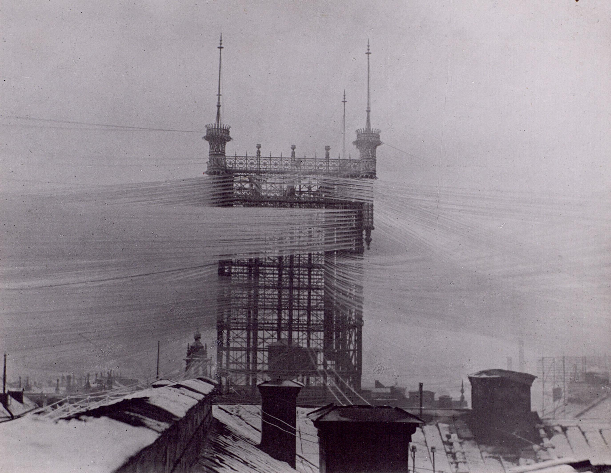
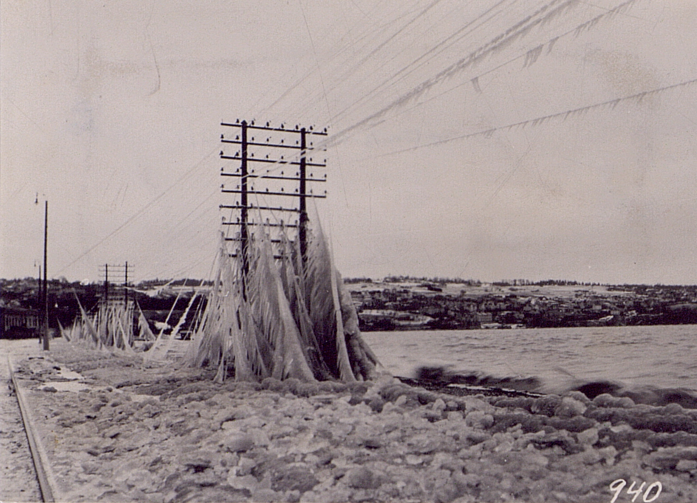
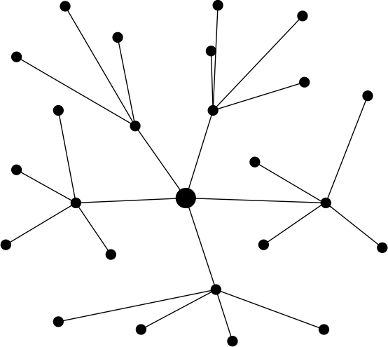

theme: Plain Jane, 2
footer: Kenji Rikitake / oueees 20230620 topic01
slidenumbers: true
autoscale: true

# oueees-202306 topic 01:
# Latency and laws of physics
# Centralized Communication
# Multiplexing

<!-- Use Deckset 2.0, 16:9 aspect ratio -->

---

# Kenji Rikitake

20-JUN-2023
School of Engineering Science, Osaka University
On the internet
@jj1bdx

Copyright ©2018-2023 Kenji Rikitake.
This work is licensed under a [Creative Commons Attribution 4.0 International License](https://creativecommons.org/licenses/by/4.0/).

---

# CAUTION

Osaka University School of Engineering Science prohibits copying/redistribution of the lecture series video/audio files used in this lecture series.

大阪大学基礎工学部からの要請により、本講義で使用するビデオ/音声ファイルの複製や再配布は禁止されています。

---

# Lecture notes and reporting

* <https://github.com/jj1bdx/oueees-202306-public/>
* Check out the README.md file and the issues!
* Keyword at the end of the talk
* URL for submitting the report at the end of the talk

---

# [fit] Latency and laws of physics

---

# [fit] Speed of light in vacuum $$c$$
# [fit] 299 792 458 [m/s]
# [fit] This is a definition, *not* a measured value

---

# Refractive indices of materials

* $$v$$: speed of light in a material
* Refractive index $$n = c / v$$, always $$n \geq 1$$!
* Air: 1.000279 for λ=0.50 µm [^1] -> 299709 km/s
* Water: 1.3330 for λ=589.3 nm [^1] -> 224901 km/s
* Silica glass (optic fiber): 1.45 [^2] -> 206753 km/s

[^1]: 「光学的性質」、理科年表2022、丸善、ISBN: 978-4-621-30648-2, pp. 477-479

[^2]: <https://apniphysics.com/classroom/optical-fiber-refractive-index/>

---

# Distance latency and timing

* Osaka to Tokyo: ~400km = ~1.3ms (in vacuum/air)
* Tokyo, Japan to San Francisco, CA, USA: ~8300km ~= 28ms (in vacuum/air), 41ms (in silica glass)
* Japan <-> USA in optic fiber, round trip: ~100ms or more
* *Synchronization is hard*
* A question: can you play a network real-time game in the global scale, e.g., between Tokyo, New York, and Paris?

---

# Light traveling time and distance
# [fit] wiring and wavelength matter

* ~300km in 1ms aka 1kHz
* ~300m in 1µs aka 1MHz
* ~30cm in 1ns aka 1GHz
* ~3mm in 1ps aka 1THz

---

# [fit] Centralized communication

---

# Communication: sharing a medium

* Sharing a physical link between two or multiple parties
* *The physical layer*
* A medium could be: electric wires, optic fibers, radio airwaves, sound, flying birds like pigeons

---

# Connecting unconnected nodes

There are many ways to connect the dots in this picture

---

# Simplest way: star/centralized connection

- Centralized connection was the easiest way to connect the nodes
- Very much susceptible to network link failures
- Links should stay connected during the connection

---

# The old Stockholm telephone tower in 1890

` `

---

# Fallen telephone lines by frost at Jönköping, Sweden, 1929

` `

---

# Tekniska museet in Stockholm
## (June 2018)

` `

---

# [fit] Multiplexing

---

# Multiplexing: sharing the same link by multiple nodes and communication devices

---

# Multiplexing enables decentralization

- Some links carry shared traffics for many different nodes

---

# How to multiplex different types of information, and put them together for sharing a same medium?

---

# Signal characteristics used for multiplexing

* Space division (multiple lines or multiple beam-formed antennas)
* Time division
* Frequency/wavelength division
* Polarization division
* Code division (multiple codes of very small cross-correlation)

---

# Photo and image credits

* All photos and images are modified and edited by Kenji Rikitake
* Photos are from Unsplash.com unless otherwise noted
* Stockholm telephone tower: [Tekniska museet](https://www.flickr.com/photos/tekniskamuseet/6838150900/in/album-72157629589461917/), from Flickr, CC BY 2.0
* Jönköping telephone lines: [Tekniska museet](https://www.flickr.com/photos/tekniskamuseet/6978810049/in/album-72157629575713829/), from Flickr, CC BY 2.0
* Tekniska museet photo: Kenji Rikitake, CC BY 4.0

<!-- Photo and image credits here -->

<!--
Local Variables:
mode: markdown
coding: utf-8
End:
-->
