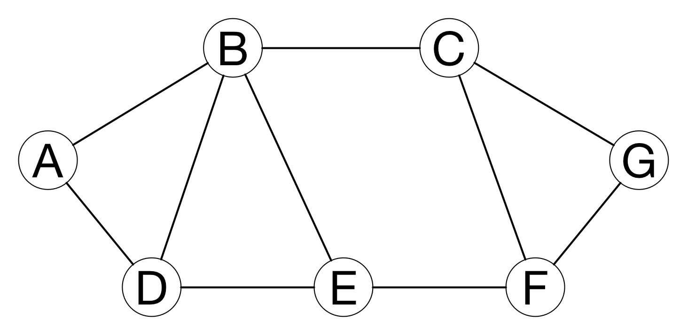

theme: Plain Jane, 2
footer: Kenji Rikitake / oueees 20230620 topic03
slidenumbers: true
autoscale: true

# oueees-202306 topic 03:
# Internet Protocol (IP) addresses
# Routing in details
# Network transports

<!-- Use Deckset 2.0, 16:9 aspect ratio -->

---

# Kenji Rikitake

20-JUN-2023
School of Engineering Science, Osaka University
On the internet
@jj1bdx

Copyright ©2018-2023 Kenji Rikitake.
This work is licensed under a [Creative Commons Attribution 4.0 International License](https://creativecommons.org/licenses/by/4.0/).

---

# CAUTION

Osaka University School of Engineering Science prohibits copying/redistribution of the lecture series video/audio files used in this lecture series.

大阪大学基礎工学部からの要請により、本講義で使用するビデオ/音声ファイルの複製や再配布は禁止されています。

---

# Lecture notes and reporting

* <https://github.com/jj1bdx/oueees-202306-public/>
* Check out the README.md file and the issues!
* Keyword at the end of the talk
* URL for submitting the report at the end of the talk

---

# [fit] Internet Protocol (IP) addresses

---

# Role of IP addresses

* Network numbers
* Interfaces: connected to the networks
* Host IDs in the numbered networks
* Global uniqueness
* Special addresses (private, broadcast, multicast, loopback, etc.)

---

# [fit] IPv4 addresses: 32 bits
# [fit] 192.168.100.20
# [fit] In hexadecimal notation: 0xC0A86414

- 4 x 0~255 numbers split with dots
- Relatively easy to remember, but already being used up

---

# [fit] IPv4 address with netmask
# [fit] 192.168.100.20/24

- Network: 192.168.100.0/24
- Host: number 20 (0~255) (32-24=8)
- Host 0 = network itself
- Host 255 = broadcast

---

# [fit] Address in another netmask
# [fit] 192.168.100.20/28

- Network: 192.168.100.16/28
- Host: number 4 (0~15) (32-28=4)
- Host 0 = network itself
- Host 15 = broadcast
- Different netmask = different address interpretation

---

# Private addresses (RFC1918)
# [fit] No global routing for these address blocks

- 10.0.0.0/8
- 172.16.0.0/12 (172.{16~31}.\*.\*)
- 192.168.0.0/16 (192.168.\*.\*)

---

# Other special addresses (RFC6890)

- 0.0.0.0/8: "This" network
- 100.64.0.0/10: Shared address
- 127.0.0.0/8: Loopback
- 169.254.0.0/16: Link local
- 192.0.0.0/24: IANA specific
- 192.0.2.0/24, 198.51.100.0/24, 203.0.113.0/24: Documentation
- 192.88.99.0/24: 6to4 Relay Anycast
- 198.18.0.0/15: Benchmarking
- 240.0.0.0/4: Reserved
- 255.255.255.255/32: Limited broadcast

---

# [fit] IPv6 addresses: 128 bits
# [fit] 2404:6800:4004:810::2004
# [fit] = 2404:6800:400a:0810:0000:0000:0000:2004

* a www.google.com address, as of 14-JUN-2023 0117UTC
* :xxxx: = up to 4 hex digits
* :: = arbitrary number of 0, appearing only once in an address
* Your lookup results may vary

---

# [fit] IPv6 addresses with netmask
# [fit] 2404:6800:400a:810::2004/64

* Network: 2404:6800:400a:810::/64
* Host number: 0x0000000000002004
* Host number: 64 bits (0: network)
* Broadcast -> multicast addresses
* ff02::1 = all hosts, ff02::2 = all routers, etc.

---

# Why IPv4 to IPv6?

- Because we've used up the 32-bit IPv4 addresses already
- No more new address block for IPv4
- You need to buy unused blocks from other users
- Took ~20 years (1996-2016) for the transition from IPv4 to IPv6
- IPv6 has less users and nodes; plausibly faster

---

# [fit] Routing in details

---

<!-- talk contents here -->
[.background-color: #FFFFFF]

---

# Static routing

- Set the default route for nodes which are not directly reachable
- Works well on simple networks or star networks
- Static routing may cause *ping-pong*

---
[.background-color: #FFFFFF]

---
[.background-color: #FFFFFF]

---

# Dynamic routing

- Hop count: count the hops between nodes
- Link cost: determined by the speed and quality
- Administrative policies

---

# Simple hop counting

- Assume every link costs the same with each other

---

[.background-color: #FFFFFF]

---

# Evaluating link cost

- What if the cost of each link varies?
- If two or more paths have the equal cost, all of the links will be utilized for load balancing

---
[.background-color: #FFFFFF]

---
[.background-color: #FFFFFF]

---

# Simulating link failures

- What if the link suddenly degrades or is disconnected?
- Largely increasing the cost of degraded or disconnected links will give an easy solution

---
[.background-color: #FFFFFF]

---

# Administrative policies

* For many reasons, you don't want to accept packets from some nodes, depending on the relay paths
* For example: passing C is OK, but passing E is not: A-B-C-G and A-B-C-F-G are OK, but A-D-E-F-G is blocked
* Common among interconnection of the autonomous systems (internet service providers and organizations)

---
[.background-color: #FFFFFF]

---

# Routing information dissemination protocols

* Link-state protocol: flooding link cost information of each node throughout the network
* Path vector protocol: exchanging path of nodes for each network instead of the link costs
* Highly vulnerable to external attacks

---

# Routing aggregation

- The following four networks
  * 192.168.100.0/24
  * 192.168.101.0/24
  * 192.168.102.0/24
  * 192.168.103.0/24
- -> aggregated as 192.168.100.0/22
- 4 networks together as one aggregated network

---

# [fit] Network transports

---

# IP address and the port number

* Each service has a 16-bit port number
* HTTPS = 443, DNS = 53, SSH = 22, etc.
* A pair of IP address and port number defines an endpoint of communication

---

# UDP and TCP

* Two major transport protocols on the internet
* User Datagram Protocol (UDP, RFC 768): connection-less
* Transport Control Protocol (TCP, RFC 9293): connection-oriented
  - Obsoleted RFCs: 793, 879, 2873, 6093, 6429, 6528, 6691
* See <https://www.rfc-editor.org> for all the internet RFCs
* RFC: Request for Comment

---

# Packet exchange limitation

* Packets are not always delivered
* Sending sequence is not preserved
* The same packet may be received multiple times
* The content of the packet may get altered or damaged
* Packet size has the limitation

---

# What UDP does

* Add a header with the port number
* Send it in an IP packet
* ... and that's it

---

---

# UDP's pros and cons

* UDP datagrams are still not always delivered and may get lost
* Sequence is not preserved
* The same datagram may be received multiple times and may cause duplicate delivery
* The errors in the contents of UDP datagrams are detectable
* UDP datagram has the size limit: suitable for relatively small messages
* Very small additional latency

---

# Transport control protocol (TCP)

* Detect packet loss by timeout
* Split stream into segments
* Put sequence numbers to the segments
* Reassemble segments to the stream
* Perform congestion control

---

---

# TCP's pros and cons

* Loss is detected and recovered so long as the connection is alive
* Sequence is preserved
* No content repetition
* Errors are detected and fixed by retransmission
* The stream will accept data so long as the connection is alive
* Data delivery may delay if retransmission occurs

---

# Web: HTTP/3: HTTP2 over QUIC

* People wants *speed* and *smaller latency*
* HTTP/2 (RFC 7540): TCP-bound, stream aggregation and content compression
* QUIC (RFC 9000): UDP-based, tightly integrated to HTTP/2 and specific congestion control
* HTTP/2 had *head-of-line blocking problem* by TCP
* HTTP/3 (RFC 9114): HTTP/2 over QUIC (supported by most browsers already)

---

# Buffering and head-of-line (HOL) blocking

* Buffering causes only the oldest packets to be forwarded
* Newer packets could be forwarded without HOL blocking
* In this example, moving buffers to output ports will avoid the delay for Output 3 at Input 1, blocked by the contention of Output 4

---

# Photo and image credits

* All photos and images are modified and edited by Kenji Rikitake
* Photos are from Unsplash.com unless otherwise noted
* UDP Encapsulation: [en:User:Cburnett original work, colorization by en:User:Kbrose, from Wikimedia Commons](https://commons.wikimedia.org/wiki/File:UDP_encapsulation.svg), CC BY-SA 3.0
* TCP Transport: [By Huage.chen from Wikimedia Commons](https://commons.wikimedia.org/wiki/File:Tcp_transport_example.gif), CC BY-SA 3.0
* Head-of-line Blocking: [By Moorcock from Wikipedia](https://en.wikipedia.org/wiki/File:HOL_blocking.png), Public Domain

<!-- Photo and image credits here -->

<!--
Local Variables:
mode: markdown
coding: utf-8
End:
-->
