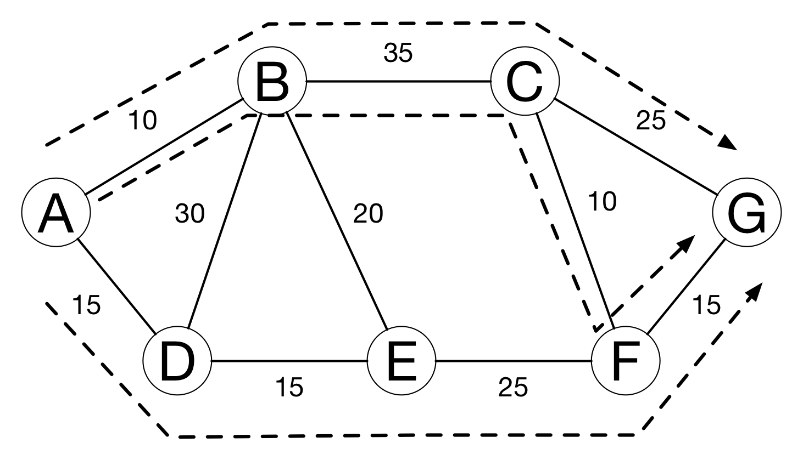
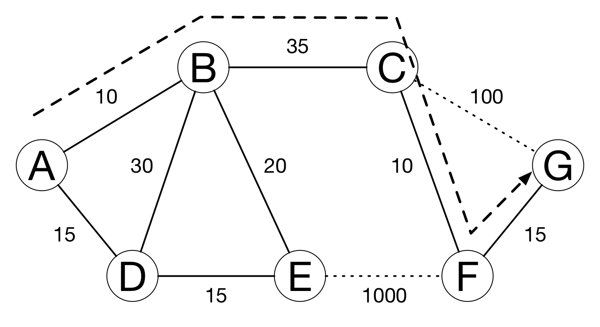

theme: Plain Jane, 2
footer: Kenji Rikitake / oueees 20230620 topic03
slidenumbers: true
autoscale: true

# oueees-202306 topic 03:
# Internet Protocol (IP) addresses
# Routing in details
# Network transports

<!-- Use Deckset 2.0, 16:9 aspect ratio -->

^ 大阪大学基礎工学部 電気工学特別講義 2023年6月20日分 トピック03 経路制御の詳細とネットワークトランスポートに関する話を始めます。

---

# Kenji Rikitake

20-JUN-2023
School of Engineering Science, Osaka University
On the internet
@jj1bdx

Copyright ©2018-2023 Kenji Rikitake.
This work is licensed under a [Creative Commons Attribution 4.0 International License](https://creativecommons.org/licenses/by/4.0/).

^ 講師の力武 健次といいます。よろしくお願いします。

---

# CAUTION

Osaka University School of Engineering Science prohibits copying/redistribution of the lecture series video/audio files used in this lecture series.

大阪大学基礎工学部からの要請により、本講義で使用するビデオ/音声ファイルの複製や再配布は禁止されています。

^ 大阪大学基礎工学部からの要請により、本講義で使用するビデオ/音声ファイルの複製や再配布は禁止されています。ご注意ください。

---

# Lecture notes and reporting

* <https://github.com/jj1bdx/oueees-202306-public/>
* Check out the README.md file and the issues!
* Keyword at the end of the talk
* URL for submitting the report at the end of the talk

^ レクチャーノートはGitHubのこのURLに掲載しています。

---

# [fit] Internet Protocol (IP) addresses

^ 経路制御に関する細かい話の一つとして、IPアドレスの話をします。IPアドレスとは、インターネットにつながる各システムに一意に割り当てられる識別子のことです。ドメイン名とは違い、固定長の整数で表現されます。IPとはインターネットプロトコルの意味です。

---

# Role of IP addresses

* Network numbers
* Interfaces: connected to the networks
* Host IDs in the numbered networks
* Global uniqueness
* Special addresses (private, broadcast, multicast, loopback, etc.)

^ IPアドレスの役割としては、ネットワークの番号、それから各ノードがどのネットワークにつながっているかを示すインターフェースの番号、ネットワークの中でのホストとしての番号を示すという重層的な意味があります。一般的にはIPアドレスは世界で一つのグローバルな一意性を持ちますが、実際には直接世界にはつながらないプライベートネットワークや、マルチキャストやブロードキャストの相手を示すアドレス、そして機器自身を示すループバックアドレスなど特別な役割を持つものもあります。

---

# [fit] IPv4 addresses: 32 bits
# [fit] 192.168.100.20
# [fit] In hexadecimal notation: 0xC0A86414

- 4 x 0~255 numbers split with dots
- Relatively easy to remember, but already being used up

^ IPアドレスとして昔から使われているのは32ビットのIPバージョン4あるいはIPv4のアドレスです。これは32ビットの整数を8ビット毎に0から255の数で表現してドットで区切ったものです。16進数で書くとC0A86414となります。一般的なIPアドレスというとこちらを指しますが、32ビットつまり2の32乗あるいは43億個弱しか区別できないんですね。すでに世界の人口は80億を越えていますから、もはやこれではまったく足らない状態になっています。

---

# [fit] IPv4 address with netmask
# [fit] 192.168.100.20/24

- Network: 192.168.100.0/24
- Host: number 20 (0~255) (32-24=8)
- Host 0 = network itself
- Host 255 = broadcast

^ このIPアドレスはどういう意味を持っているかというと、上位ビットからネットワークを示すビット長（ネットマスクともいいます）を決めて、残りをそのネットワークの中のホスト識別に使うことになっています。ここで示す192.168.100.0/24というアドレスは、ホスト識別部がゼロなので、ネットワーク自身を示します。たまたまドット区切りとネットワークの区切りがいっしょですね。なおホスト識別部のビットが全部1だと、ブロードキャストアドレスを示します。

---

# [fit] Address in another netmask
# [fit] 192.168.100.20/28

- Network: 192.168.100.16/28
- Host: number 4 (0~15) (32-28=4)
- Host 0 = network itself
- Host 15 = broadcast
- Different netmask = different address interpretation

^ 似たようなアドレスですが意味の違う例を示します。この例ではドット区切りとネットワークの区切りがいっしょではありません。ネットワーク部は28ビットありますので、ホスト識別部は4ビットしかありません。また、ネットマスクが違うので、前のスライドの192.168.100.0/24とは違うネットワークとして認識する必要があります。

---

# Private addresses (RFC1918)
# [fit] No global routing for these address blocks

- 10.0.0.0/8
- 172.16.0.0/12 (172.{16~31}.\*.\*)
- 192.168.0.0/16 (192.168.\*.\*)

^ プライベートアドレスという話をします。現在IPv4インターネットに接続されているホストの大部分はこのプライベートアドレスを使っています。プライベートアドレスには、ネットワークを外部から切り離すこと、そしてその結果としてグローバルな到達性を持ったアドレスの消費を抑える、という2つの役割があります。切り離したネットワークをインターネットに接続するにはアドレス変換(NAT)という技術を使いますが、この講義では詳細は割愛します。

---

# Other special addresses (RFC6890)

- 0.0.0.0/8: "This" network
- 100.64.0.0/10: Shared address
- 127.0.0.0/8: Loopback
- 169.254.0.0/16: Link local
- 192.0.0.0/24: IANA specific
- 192.0.2.0/24, 198.51.100.0/24, 203.0.113.0/24: Documentation
- 192.88.99.0/24: 6to4 Relay Anycast
- 198.18.0.0/15: Benchmarking
- 240.0.0.0/4: Reserved
- 255.255.255.255/32: Limited broadcast

^ その他にもいろいろな役割を持ったアドレスがあります。これらの役割については詳細を記した文書があります。一例として、文書に書く場合は特定の組織などを代表しないように、文書で例示するため専用のアドレス空間があります。実際に使われている電話番号を説明用のマニュアルに書いたら個人情報の漏洩になりかねないですよね。

---

# [fit] IPv6 addresses: 128 bits
# [fit] 2404:6800:4004:810::2004
# [fit] = 2404:6800:400a:0810:0000:0000:0000:2004

* a www.google.com address, as of 14-JUN-2023 0117UTC
* :xxxx: = up to 4 hex digits
* :: = arbitrary number of 0, appearing only once in an address
* Your lookup results may vary

^ IPv4アドレスではアドレスが不足してしまうため、最近のインターネットではIPバージョン6あるいはIPv6アドレスも使われています。これは128ビット固定長の整数で、16進数4桁ごとにコロンで区切って表します。0が続く部分は一度だけコロン2つで省略できるようになっています。例示したのは最近確認したwww.google.comのアドレスです。

---

# [fit] IPv6 addresses with netmask
# [fit] 2404:6800:400a:810::2004/64

* Network: 2404:6800:400a:810::/64
* Host number: 0x0000000000002004
* Host number: 64 bits (0: network)
* Broadcast -> multicast addresses
* ff02::1 = all hosts, ff02::2 = all routers, etc.

^ このアドレスですが、慣例としてネットマスクは64ビットとして使われています。これだけあればアドレスの不足は当分ないだろうと考えられています。ネットワーク自身はIPv4と同様ホスト識別部あるいは下位64ビットが0で表現されますが、IPv4で使われていたブロードキャストアドレスはIPv6ではマルチキャスト専用のネットワーク識別子を使うように変わりました。

---

# Why IPv4 to IPv6?

- Because we've used up the 32-bit IPv4 addresses already
- No more new address block for IPv4
- You need to buy unused blocks from other users
- Took ~20 years (1996-2016) for the transition from IPv4 to IPv6
- IPv6 has less users and nodes; plausibly faster

^ なぜIPv4とIPv6が並立しているかについて説明します。IPv4のアドレスはもう新規に割り当てる場所がなく、使わなくなったアドレスは市場で高値で取り引きされている状況です。ですので、大規模な新規ネットワークアプリケーションはIPv6アドレスを使うことが増えました。IPv6が提案されてから移行普及に実質20年かかっていますが、未だにIPv4アドレスを前提としたサービスも多数残っており、IPv6の規模そのものはIPv4に比べて小さな状況が続いています。

---

# [fit] Routing in details

^ ここからは経路制御の細かい話をします。

---

<!-- talk contents here -->
[.background-color: #FFFFFF]

^ 図のような7つのノードが接続されたネットワークを考えます。

---

# Static routing

- Set the default route for nodes which are not directly reachable
- Works well on simple networks or star networks
- Static routing may cause *ping-pong*

^ 静的経路制御あるいはスタティックルーティングで経路を決めることを考えます。具体的には直接接続されていないネットワークに対して送信するときは、とりあえず既定値あるいはデフォルトの経路を決めて送信します。

---
[.background-color: #FFFFFF]

^ この図ではデフォルト経路は右回り隣のノードに送信しています。このやり方は簡単なネットワーク、特にスター型ではうまく機能しますが、場合によってはパケットがピンポンして無限ループを起こしてしまうことがあります。

---
[.background-color: #FFFFFF]

^ この図ではBが左回りにデフォルト経路を設定しているため、AがGにパケットを送信しようとすると、GはAにもBにもつながっていないため、それぞれのデフォルト経路でAからBへ、BからAへとパケットが無限ループしてしまいます。

---

# Dynamic routing

- Hop count: count the hops between nodes
- Link cost: determined by the speed and quality
- Administrative policies

^ スタティックな経路制御ではうまくいかない場合もあることがわかりました。そこで何らかの形で経路を決定するアルゴリズムを考えてみます。一般的なやり方としては、ノード間の中継数あるいはホップ数を数えたり、ノード間のリンクに対して速度や品質を反映したコストを設定して積算したりする方法があります。また、あらかじめ管理方針を決めて制限するというやり方もあります。このような動的な経路制御では、ネットワーク全域で経路情報を共有するというやり方をします。

---

# Simple hop counting

- Assume every link costs the same with each other

^ 単純にホップ数を数えるやり方を考えてみましょう。これはそれぞれのリンクのコストが同じ場合に、最小コストの経路を求めよという問題と同値になります。

---

[.background-color: #FFFFFF]

^ 図の場合で考えてみると、AからGへの最小コスト経路は、A-B-C-Gでコストが30になります。A-D-E-F-Gは、コストが40で、次にコストの少ない経路となります。

---

# Evaluating link cost

- What if the cost of each link varies?
- If two or more paths have the equal cost, all of the links will be utilized for load balancing

^ ここでコストをどう設定あるいは評価するかについて考えてみます。それぞれのリンクのコストが違っていたら最適経路は変わります。また、2つ以上の経路が同じコストであれば、それらを同じように使うことで、各ノードの負荷を抑えることもできます。

---
[.background-color: #FFFFFF]

^ この図ではそれぞれの経路のリンクのコストを変えてあります。

---
[.background-color: #FFFFFF]

^ コストを積算してみると、A-B-C-Gのコストは70, A-B-C-F-Gのコストも70、A-D-E-F-Gのコストも70となります。このコスト情報が7つのノードに行き渡っていれば、Aはこの3つの経路を同じコストとして判定して使い分けることができるようになります。

---

# Simulating link failures

- What if the link suddenly degrades or is disconnected?
- Largely increasing the cost of degraded or disconnected links will give an easy solution

^ リンクの速度やエラー率などの品質が悪化したり、切断して障害が発生した場合を考えてみます。これらの事象をリンクコストを使った経路制御に反映するには、該当するリンクのコストを大幅に上げるのが効果的な方法の一つです。

---
[.background-color: #FFFFFF]

^ この図ではC-Gの品質が悪化しリンクコストが100となり、E-Fで障害が発生したためリンクコストを1000としてみました。このような状況になると、最小リンクコストの経路は自動的にA-B-C-F-Gの70のみに定まるようになります。

---
# Administrative policies

* For many reasons, you don't want to accept packets from some nodes, depending on the relay paths
* For example: passing C is OK, but passing E is not: A-B-C-G and A-B-C-F-G are OK, but A-D-E-F-G is blocked
* Common among interconnection of the autonomous systems (internet service providers and organizations)

^ 同じ組織など管理方針が同じネットワークの中であればリンクコストの計算で経路制御ができますが、そうでない組織間の場合は、どの経路を通ってくるかを調べて通信を遮断したい場合があります。このような遮断要請は、接続事業者などの間で一般的に行われています。今までの図でいえば、たとえばEを通過させたくないという方針を考えてみましょう。

---
[.background-color: #FFFFFF]

^ この図ではEが遮断されている状況を考えます。このような遮断を実現するためには、リンクコストの情報ではうまくいきません。どのノードを通ったかを記録した上で、Eを通るものを明示的に識別して遮断できるようにすることが必要です。

---

# Routing information dissemination protocols

* Link-state protocol: flooding link cost information of each node throughout the network
* Path vector protocol: exchanging path of nodes for each network instead of the link costs
* Highly vulnerable to external attacks

^ 経路情報のやり取りをするための手順あるいはプロトコルとしては、今まで説明してきたネットワーク全体にリンクコスト情報をどんどん広げていくリンクステートプロトコルというのがあります。また、リンクコストではなく使用できる中継経路を列挙していくパスベクトルプロトコルもあります。経路情報プロトコルへの攻撃は、ネットワーク運用に対して大きな被害の原因になります。

---

# Routing aggregation

- The following four networks
  * 192.168.100.0/24
  * 192.168.101.0/24
  * 192.168.102.0/24
  * 192.168.103.0/24
- -> aggregated as 192.168.100.0/22
- 4 networks together as one aggregated network

^ 経路情報はインターネット全体を考えると莫大な量になります。そこで少しても経路情報の量を減らすために、集約する方法が使われています。ここに示した例では、ネットマスクが/24の連続したアドレス空間を使っている4つのネットワークを、ネットマスクが/22の1つのネットワークとして集約しています。

---

# [fit] Network transports

---

# IP address and the port number

* Each service has a 16-bit port number
* HTTPS = 443, DNS = 53, SSH = 22, etc.
* A pair of IP address and port number defines an endpoint of communication

---

# UDP and TCP

* Two major transport protocols on the internet
* User Datagram Protocol (UDP, RFC 768): connection-less
* Transport Control Protocol (TCP, RFC 9293): connection-oriented
  - Obsoleted RFCs: 793, 879, 2873, 6093, 6429, 6528, 6691
* See <https://www.rfc-editor.org> for all the internet RFCs
* RFC: Request for Comment

---

# Packet exchange limitation

* Packets are not always delivered
* Sending sequence is not preserved
* The same packet may be received multiple times
* The content of the packet may get altered or damaged
* Packet size has the limitation

---

# What UDP does

* Add a header with the port number
* Send it in an IP packet
* ... and that's it

---

---

# UDP's pros and cons

* UDP datagrams are still not always delivered and may get lost
* Sequence is not preserved
* The same datagram may be received multiple times and may cause duplicate delivery
* The errors in the contents of UDP datagrams are detectable
* UDP datagram has the size limit: suitable for relatively small messages
* Very small additional latency

---

# Transport control protocol (TCP)

* Detect packet loss by timeout
* Split stream into segments
* Put sequence numbers to the segments
* Reassemble segments to the stream
* Perform congestion control

---

---

# TCP's pros and cons

* Loss is detected and recovered so long as the connection is alive
* Sequence is preserved
* No content repetition
* Errors are detected and fixed by retransmission
* The stream will accept data so long as the connection is alive
* Data delivery may delay if retransmission occurs

---

# Web: HTTP/3: HTTP2 over QUIC

* People wants *speed* and *smaller latency*
* HTTP/2 (RFC 7540): TCP-bound, stream aggregation and content compression
* QUIC (RFC 9000): UDP-based, tightly integrated to HTTP/2 and specific congestion control
* HTTP/2 had *head-of-line blocking problem* by TCP
* HTTP/3 (RFC 9114): HTTP/2 over QUIC (supported by most browsers already)

---

# Buffering and head-of-line (HOL) blocking

* Buffering causes only the oldest packets to be forwarded
* Newer packets could be forwarded without HOL blocking
* In this example, moving buffers to output ports will avoid the delay for Output 3 at Input 1, blocked by the contention of Output 4

---

# Photo and image credits

* All photos and images are modified and edited by Kenji Rikitake
* Photos are from Unsplash.com unless otherwise noted
* UDP Encapsulation: [en:User:Cburnett original work, colorization by en:User:Kbrose, from Wikimedia Commons](https://commons.wikimedia.org/wiki/File:UDP_encapsulation.svg), CC BY-SA 3.0
* TCP Transport: [By Huage.chen from Wikimedia Commons](https://commons.wikimedia.org/wiki/File:Tcp_transport_example.gif), CC BY-SA 3.0
* Head-of-line Blocking: [By Moorcock from Wikipedia](https://en.wikipedia.org/wiki/File:HOL_blocking.png), Public Domain

<!-- Photo and image credits here -->

<!--
Local Variables:
mode: markdown
coding: utf-8
End:
-->
