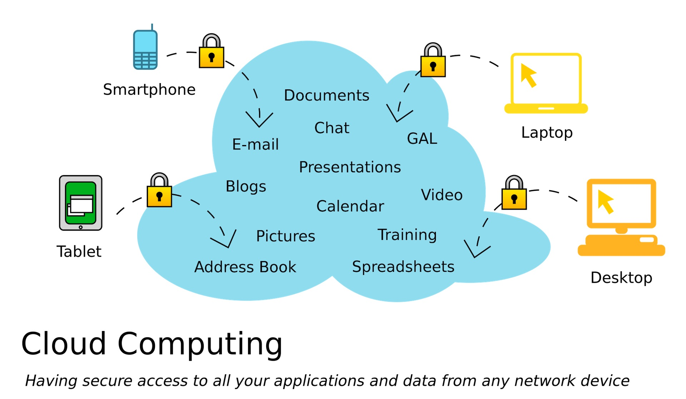
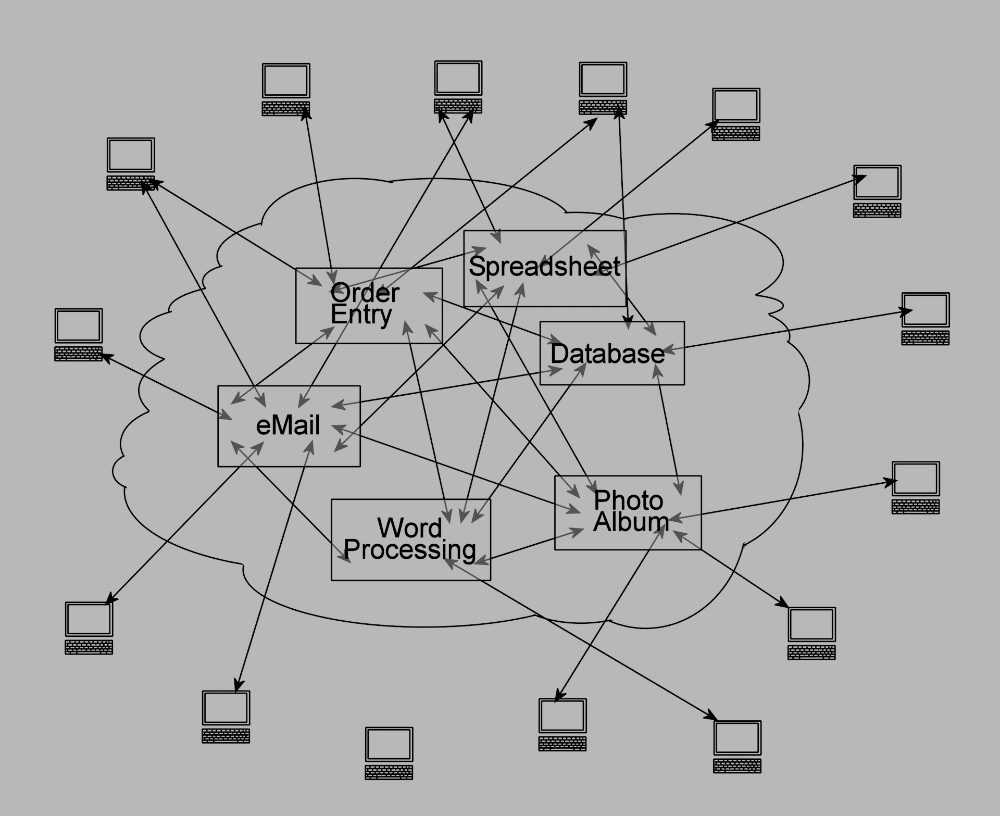
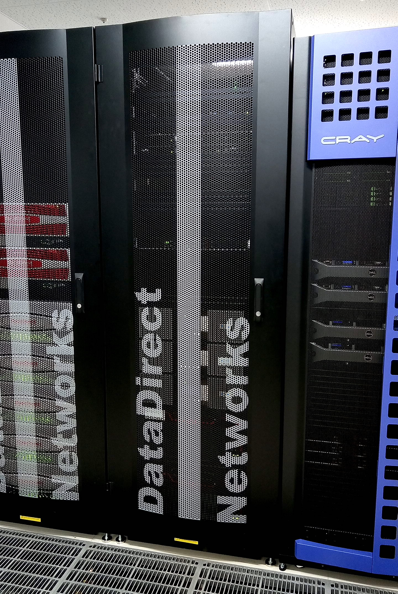
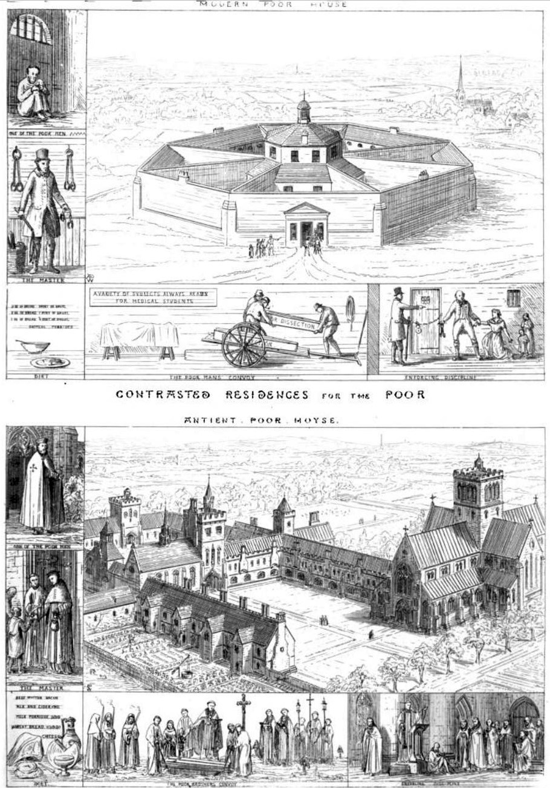

theme: Plain Jane, 2
footer: Kenji Rikitake / oueees 20230620 topic04
slidenumbers: true
autoscale: true

# oueees-202306 topic 04:
# Cloud computing basics
# Social implication of cloud computing

<!-- Use Deckset 2.0, 16:9 aspect ratio -->

---

# Kenji Rikitake

20-JUN-2023
School of Engineering Science, Osaka University
On the internet
@jj1bdx

Copyright ©2018-2023 Kenji Rikitake.
This work is licensed under a [Creative Commons Attribution 4.0 International License](https://creativecommons.org/licenses/by/4.0/).

---

# CAUTION

Osaka University School of Engineering Science prohibits copying/redistribution of the lecture series video/audio files used in this lecture series.

大阪大学基礎工学部からの要請により、本講義で使用するビデオ/音声ファイルの複製や再配布は禁止されています。

---

# Lecture notes and reporting

* <https://github.com/jj1bdx/oueees-202306-public/>
* Check out the README.md file and the issues!
* Keyword at the end of the talk
* URL for submitting the report at the end of the talk

---

# [fit] Cloud computing basics

---

# Modern computing *is cloud computing*

---
[.background-color: #ffffff]

---

# Is cloud really a uniform and single entity?

---

# Absolutely not: it's an intertwined *network* of computers

---

# Web services are clusters of computers and networks

Thousands or millions of servers connected together

A physical server is separated into multiple virtual machines

---

# Cloud computing *is* centralization

---

# An example of cloud computing: Internet of Things (IoT) and telemetering

---

[.background-color: #ffffff]

---

# Telemetering

* Mostly unidirectional (not really *the true and genuine internet*)
* Sensors/devices gathering data through internet and feed them to the servers in the cloud computing platforms
* *The servers compute*
* *Extremely centralized*

---

# [fit] Social implication of cloud computing

---

<!-- talk contents here -->
## Centralized social behavior accerelated by cloud computing

* Sharing *everything* - no privacy
* *Panopticon* [^1] style of governance, filtering, *censorship, or autocracy*
* Complete *externalization* of resources, leading to *no personal control*

[^1]: n. a circular prison with cells arranged around a central well, from which prisoners could at all times be observed. (New Oxford American Dictionary, Apple macOS 10.13.6)

---

# Presidio Modelo: a panopticon prison

---

[.background-color: #ffffff]

---

# INGSOC: the slogans [^2]

* War is peace
* Freedom is slavery
* Ignorance is strength

* Independent thinking = *thoughtcrime*

## NOTE: this is a *fiction*!

[^2]: George Orwell, "Nineteen Eighty-Four", 1949.

---

# Historical examples of INGSOC-like nations

* Nazi Germany [^3]
* Empire of Japan [^4] (Japan in 1868-1947)
* Soviet Union [^5] 
* ... you can pick up many nations currently existing

[^3]: <https://en.wikipedia.org/wiki/Nazi_Germany>

[^4]: <https://en.wikipedia.org/wiki/Empire_of_Japan>

[^5]: <https://en.wikipedia.org/wiki/Soviet_Union>

---

# [fit] Why cloud computing has become
# [fit] so *dystopian*?

---

# We have sold freedom for *convenience*

* Ubiquitous/global accessibility
* Concentrated data for easy analysis
* Easy control of the information flow
* No extra cost for sharing
* No need to think about where the information locates
* A useful tool for fascist and despotic regimes

---

# The inconvenient truth of centralized systems: what if the core/cloud fails?

---

## Inconvenience of centralized systems

* Ubiquity or *no accessibility*
* When the core fails, no alternative
* When the core loses data, *no backup*
* The system performance is restricted by the capability of the core
* Endpoint systems will lost *all capabilities*

---

# Centralized systems are *not* sustainable

## ...then how cloud computing systems manages the sustainability?

---

# Distributed systems provide sustainability and resilience against failures

---

# Photo and image credits

* All photos and images are modified and edited by Kenji Rikitake
* Photos are from Unsplash.com unless otherwise noted

* Presidio Modelo Prison: By Friman [Public domain], from [Wikimedia Commons](https://commons.wikimedia.org/wiki/File:Presidio_Modelo.JPG)
* Panopticon: Jeremy Bentham, Public domain, via [Wikimedia Commons](https://commons.wikimedia.org/wiki/File:Panopticon.jpg)
* Contrasted Residences for The Poor: By Augustus Pugin [Public domain], via [Wikimedia Commons](https://commons.wikimedia.org/wiki/File:Contrasted_Residences_for_the_Poor.jpg)
* Modern Computing is Cloud Computing: Rayi Christian Wicaksono
* Cloud Computing: <https://commons.wikimedia.org/wiki/File:Cloud_applications_SVG.svg>, licensed under [Creative Commons CC0 1.0 Universal Public Domain Dedication](https://creativecommons.org/publicdomain/zero/1.0/deed.en)
* Intertwined network of computers: <https://en.wikipedia.org/wiki/File:Cloud_Computing.jpg>, licensed under [Creative Commons CC0 1.0 Universal Public Domain Dedication](https://creativecommons.org/publicdomain/zero/1.0/deed.en)
* Web services are clusters of computers: Kenji Rikitake, at Kyoto University ACCMS, April 2017

<!--
Local Variables:
mode: markdown
coding: utf-8
End:
-->
