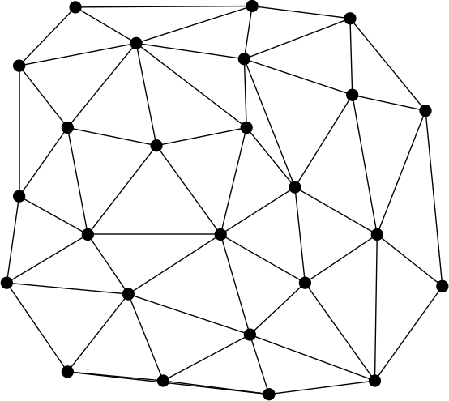

theme: Plain Jane, 2
footer: Kenji Rikitake / oueees 20230620 topic05
slidenumbers: true
autoscale: true

# oueees-202306 topic 05:
# Network fault-tolerance
# Network services and programming trends

<!-- Use Deckset 2.0, 16:9 aspect ratio -->

---

# Kenji Rikitake

20-JUN-2023
School of Engineering Science, Osaka University
On the internet
@jj1bdx

Copyright ©2018-2023 Kenji Rikitake.
This work is licensed under a [Creative Commons Attribution 4.0 International License](https://creativecommons.org/licenses/by/4.0/).

---

# CAUTION

Osaka University School of Engineering Science prohibits copying/redistribution of the lecture series video/audio files used in this lecture series.

大阪大学基礎工学部からの要請により、本講義で使用するビデオ/音声ファイルの複製や再配布は禁止されています。

---

# Lecture notes and reporting

* <https://github.com/jj1bdx/oueees-202306-public/>
* Check out the README.md file and the issues!
* Keyword at the end of the talk
* URL for submitting the report at the end of the talk

---

# [fit] Network fault-tolerance

---

<!-- talk contents here -->

[.background-color: #ffffff]

---

# Networks *split*

---
[.background-color: #ffffff]

---

# Partition/fault tolerance: distributed systems should not stop working even if netsplit occurs

---

# Real-world challenges

* Natural disasters
* Device failures
* Human operation errors
* Political impediments
* Social resentments

---

# Handling *failures*

* Redundancy: keeping backup units ready
* Fault tolerance: keeping systems running even the components fail
* Resilience by failing fast: early detection of failures and invocation of the recovery procedures

---

# Why fault tolerance?

* Hard disk MTBF ~= 1 million hours
* 1000 hard disks running 24 hours x 365 days = 8.76 million  hours
* If you're running a system with 1000 hard disks, **9 out of 1000** will fail in a year
* Recovery of a disk content takes often *a day*; you can't stop a system for *a day*, can you?

---

# Requirement to keep the systems fault tolerant

* Redundancy: two or more resources for each unit of processing
* Supervising the failure of the units by an independent supervisor
* Rollback capability: undo the incomplete operations and retry

---

# Consistency issues of distributed systems

* Locking/synchronization: waiting all data to be ready to compute or proceed to next step
* Choosing the *right* data: which data is *correct*?
* Supervision: fault detection and restarting

---
[.background-color: #ffffff]

---
[.background-color: #ffffff]

---

# Eight Fallacies of Distributed Computing[^3] (1/2)

* **The network is reliable**
* **Latency is zero**
* **Bandwidth is infinite**
* The network is secure

[^3]: <https://blog.fogcreek.com/eight-fallacies-of-distributed-computing-tech-talk/>

---

# Eight Fallacies of Distributed Computing (2/2)

* Topology doesn't change
* There is one administrator
* Transport cost is zero
* The network is homogeneous

---

# Summary: centralized computing is fragile; distributed computing is fault tolerant but hard

---

# [fit] Network services and programming trends

---

# Trends of (network) services

* Becoming hybrid and more complex, many different parts
* Web design: user experience (UX), accessibility, usability
* Development: database, web frontend, web backend
* Site Reliability Engineering (SRE), infrastructure and operation
* Security: vulnerability assessment, incident response

---

# [fit] Why learning programming?
# [fit] Programming = making software
# [fit] Programming is the only way to fabricate a system
# [fit] Computers can only do their job through programming 
# [fit] It's often *you* need to write the code, not somebody else

---

# [fit] Programming is a
# [fit] language
# [fit] There are various languages which fit and don't fit your requirement
# [fit] There are no good or bad programming languages

---

# [fit] Modern software development:
# [fit] team, library, and ecosystem

* Development as a *team*, not just individual
* Depending on *libraries*, not just newly-written code
* Depending on the *ecosystem*, not just you and your team

---

# So what to learn?

* Popular ones (C++, JavaScript, Python, etc.)
* *Required* ones by your tasks (old languages)
* For experiments and prototyping (esoteric languages)
* Learning a programming language can change your mind

---

# My suggestions: Erlang/Elixir for concurrency

* Concurrency is the key for distributed network programming
* Erlang for learning the basic functional programming
* Elixir for applying functional programming for web
* Disclaimer: these languages are not necessarily popular, but will surely change how you understand computer programming

---

# [fit] すごいErlangゆかいに学ぼう!

- オーム社 ISBN 9784274069123
- [達人出版会の電子書籍](https://tatsu-zine.com/books/sugoi-erlang-ja)

---

# [fit] プログラミングElixir 第2版

- オーム社 ISBN 9784274226373
- [達人出版会の電子書籍](https://tatsu-zine.com/books/programming-elixir-2ed)

---

# Photo and image credits

* All photos and images are modified and edited by Kenji Rikitake
* Photos are from Unsplash.com unless otherwise noted

<!-- Photo and image credits here -->

* Networks: Irina Blok
* Networks Split: Pietro De Grandi
* Netsplit: <https://commons.wikimedia.org/wiki/File:Netsplit_split.svg>, in public domain

<!--
Local Variables:
mode: markdown
coding: utf-8
End:
-->
