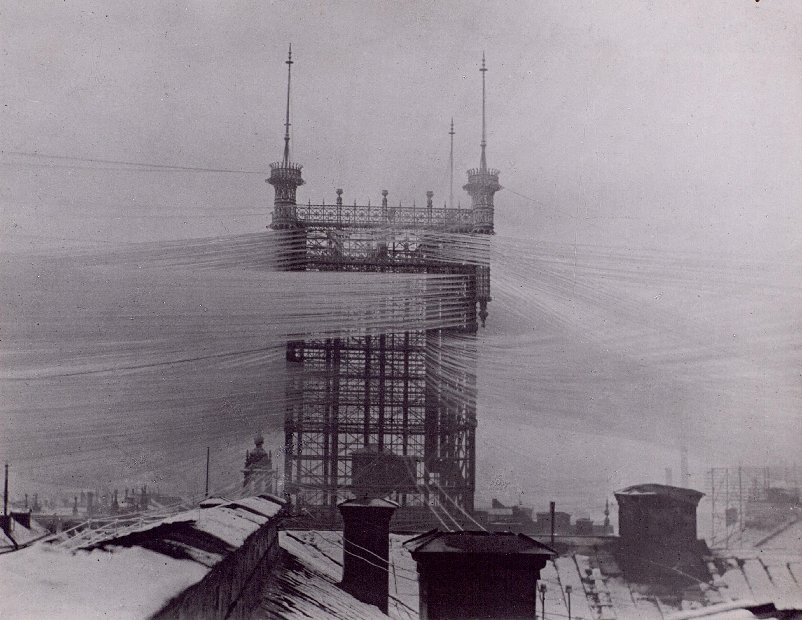
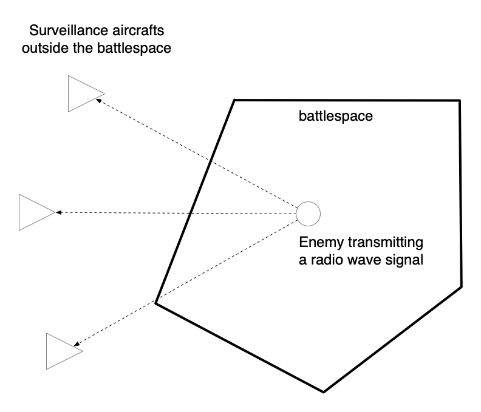

theme: Plain Jane, 2
footer: Kenji Rikitake / oueees 20230620 topic06
slidenumbers: true
autoscale: true

# oueees-202306 topic 06:
# Wireless/radio and internet
# Information warfare and radio surveillance

<!-- Use Deckset 2.0, 16:9 aspect ratio -->

---

# Kenji Rikitake

20-JUN-2023
School of Engineering Science, Osaka University
On the internet
@jj1bdx

Copyright ©2018-2023 Kenji Rikitake.
This work is licensed under a [Creative Commons Attribution 4.0 International License](https://creativecommons.org/licenses/by/4.0/).

---

# CAUTION

Osaka University School of Engineering Science prohibits copying/redistribution of the lecture series video/audio files used in this lecture series.

大阪大学基礎工学部からの要請により、本講義で使用するビデオ/音声ファイルの複製や再配布は禁止されています。

---

# Lecture notes and reporting

* <https://github.com/jj1bdx/oueees-202306-public/>
* Check out the README.md file and the issues!
* Keyword at the end of the talk
* URL for submitting the report at the end of the talk

---

# [fit] Wireless/radio and internet

---

# [fit] Direct wired network at the maximum extent
# [fit] This is the old Stockholm telephone tower in 1890 (see Topic 02)

---

# [fit] Lessons learned: wired networks do not necessarily scale well

* Difficult to install, often impossible
* Easily get cut/disconnected by accidents
* Difficult to reconfigure/rewire
* Individual link management is complex and often erratically done

---

# [fit] Remove the wire!

---

# [fit] Wireless/radio networks
# [fit] as a replacement of wired networks

---

# Limitations of radio networks by physics

* Speed limited by radio frequency bandwidth
* Latency increased by (de)modulation and packetization
* Excessively large error rate due to obstacles (burst errors), fading, interference, and etc.: *Error-correction encoding required*
* Radiation spillover causes content disclosure: *encryption required*
* The source of interference is immensely difficult to locate
* Still requires a lot of wiring to the base stations

---

# [fit] Advantages of radio networks:
# [fit] Mobility

* Providing connections to where no wires can connect
* Nodes can move around while maintaining the connectivity

---

# [fit] Implementation issues to overcome for 5G era:
# [fit] Low channel capacity and short reachability 

* Trade-off between frequency bandwidth, reachable range, and base station installation
* Massive interference between nodes and networks
* Latency issues due to (de)modulation will persistently remain

---

# [fit] Information warfare
# and
# [fit] radio surveillance

---

# Information warfare

> Information warfare (IW) (as different from cyber warfare that attacks computers, software, and command control systems) is a concept involving the battlespace use and management of information and communication technology (ICT) in pursuit of a competitive advantage over an opponent. 
-- Wikipedia [^1]

[^1]: <https://en.wikipedia.org/wiki/Information_warfare>

---

# What Russo-Ukraine War has revealed so far as of June 2022

---

# *DON'T: unencrypted communications are still widely used in the battlespace (?!)*

Unencrypted communications are thoroughly monitored and actually exploited to neutralize weapons, soldiers and commanders: many commanders of Russian Forces became KIA [^2]

All radio airwaves are heard and can be heard from several hundred kilometers (or even more from satellites or through the ionospheric propagation)

[^2]: Killed in Action (NATO definition) Wikipedia: <https://en.wikipedia.org/wiki/Killed_in_action>

---

# Locating enemies by triangulation from outside the battlespace

Aircrafts outside the battlespace can find the direction of the incoming signal

Aggregating the reception timing difference information of three (3) or more aircrafts receiving the signal for the enemy, the position of the enemy can be precisely estimated (four (4) or more for also locating the altitude) [^3]

[^3]: Hyperbolic navigation / Wikipedia: <https://en.wikipedia.org/wiki/Hyperbolic_navigation>

---

# *DON'T: smartphone and cell phone networks are NOT protected end-to-end and can be monitored!*

Using a SIM card provided by *the adversaries* on your smartphone means all your communication contents are *thoroughly wiretapped and can be exploited against you!*

TLDR: *don't use a SIM card dropped on the floor or given by an untrusted person!* 

Corollary: *don't use an USB memory or a MicroSD card dropped on the floor or given by an untrusted person!*

---

# DO: always use encryption during (or even not during) the war

Modern TLS and HTTPS encryption is strong enough to thwart an attempt to eavesdrop the communication

Using a strong end-to-end encryption such as OpenPGP and GnuPG is a plus (though the user interface is still clumsy)

*NOTE WELL AND CAUTION: "safe" messaging services are not necessarily really so*, especially the centralized ones!

---

# TLDR: your radiowave emission can be monitored by unwanted and untrusted people and can be exploited and used against you at any time. You have been warned.

---

# Photo and image credits

* All photos and images are modified and edited by Kenji Rikitake
* Photos are from Unsplash.com unless otherwise noted
* Free Wifi Inside: [Photo by Bernard Hermant](https://unsplash.com/photos/X0EtNWqMnq8)
* Pedestrians: [Photo by Ryoji Iwata](https://unsplash.com/photos/IBaVuZsJJTo)

<!--
Local Variables:
mode: markdown
coding: utf-8
End:
-->
