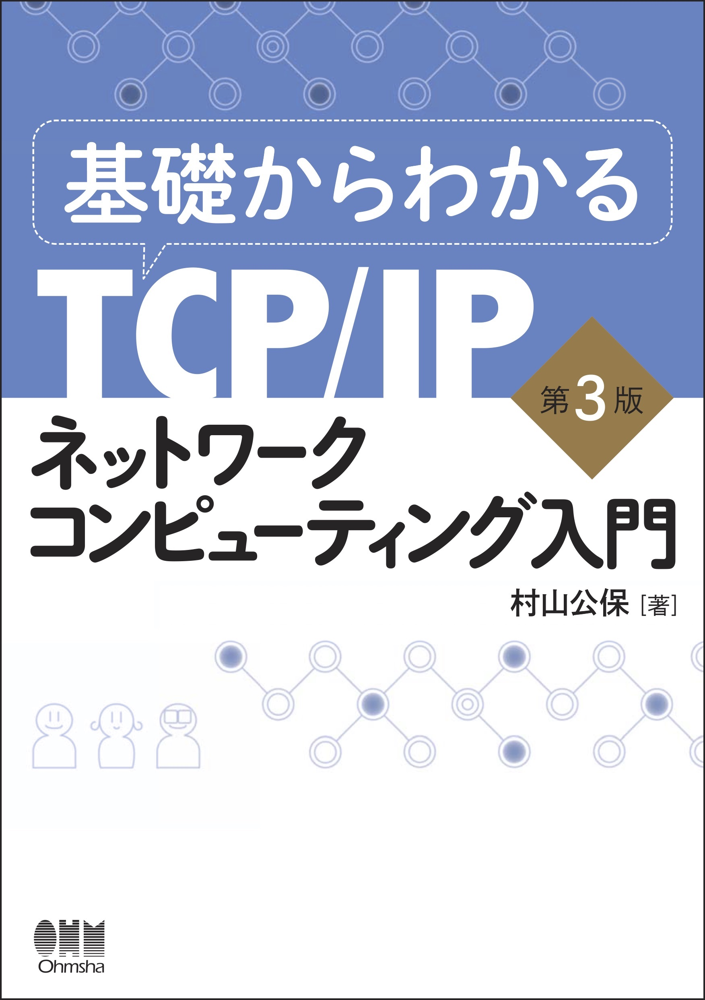

theme: Plain Jane, 2
footer: Kenji Rikitake / oueees 20230620 topic07
slidenumbers: true
autoscale: true

# oueees-202306 topic 07:
# Reference for further study
# Choosing your career and professionality

<!-- Use Deckset 2.0, 16:9 aspect ratio -->

---

# Kenji Rikitake

20-JUN-2023
School of Engineering Science, Osaka University
On the internet
@jj1bdx

Copyright ©2018-2023 Kenji Rikitake.
This work is licensed under a [Creative Commons Attribution 4.0 International License](https://creativecommons.org/licenses/by/4.0/).

---

# CAUTION

Osaka University School of Engineering Science prohibits copying/redistribution of the lecture series video/audio files used in this lecture series.

大阪大学基礎工学部からの要請により、本講義で使用するビデオ/音声ファイルの複製や再配布は禁止されています。

---

# Lecture notes and reporting

* <https://github.com/jj1bdx/oueees-202306-public/>
* Check out the README.md file and the issues!
* Keyword at the end of the talk
* URL for submitting the report at the end of the talk

---

# [fit] Reference for further study

---

# 基礎からわかるTCP/IPネットワークコンピューティング入門 第3版

- オーム社 ISBN 9784274050732
- [達人出版会の電子書籍](https://tatsu-zine.com/books/kiso-tcpip-nwcp3)

---

# プロフェッショナルIPv6 第2版

- ラムダノート ISBN 9784908686115
- [ラムダノートの紙の本+電子書籍](https://www.lambdanote.com/products/ipv6-2)
- [Boothの無料版](https://professionalipv6.booth.pm/items/913273)
- 昨年2021年に第2版が刊行されました

---

# プロフェッショナルSSL/TLS

- ラムダノート ISBN 9784908686009
- [ラムダノートの紙の本+電子書籍](https://www.lambdanote.com/products/tls)
- [無料の抜粋版「OpenSSLクックブック」](https://www.lambdanote.com/products/openssl)

---

# [fit] Choosing your career and professionality

---

 When I chose my career and professionality?

* Age 9: computers and English
* Age 10 ham radio and electronics
* Age 14: writing commercial software
* *Age 23: finally decided to make my living on my computer software professionality, with my English proficiency*

---

# If I were at age 22, what I would do after getting a Bachelor's degree?

* Get out of Japan ASAP
* Explore the computer skills
* Do something unpopular

# [fit] Go abroad

---

# What are the most important things to pursue engineering/scientist career?

* Physical strength
* Mental strength
* Curiosity

# [fit] Curiosity matters

<!--
Local Variables:
mode: markdown
coding: utf-8
End:
-->
